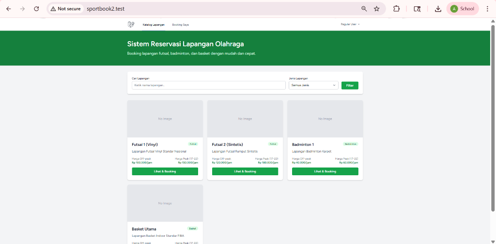
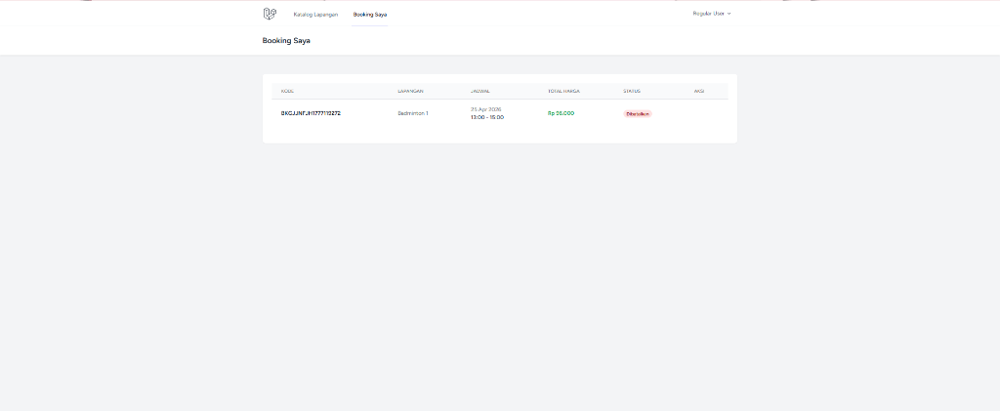
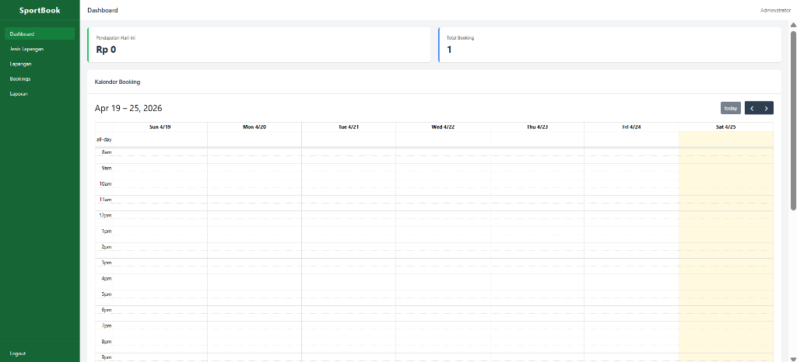
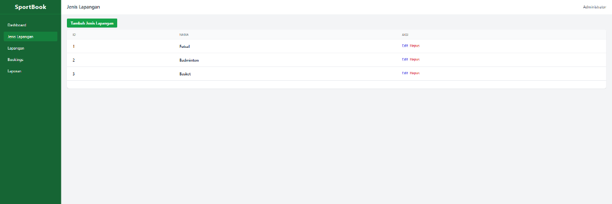
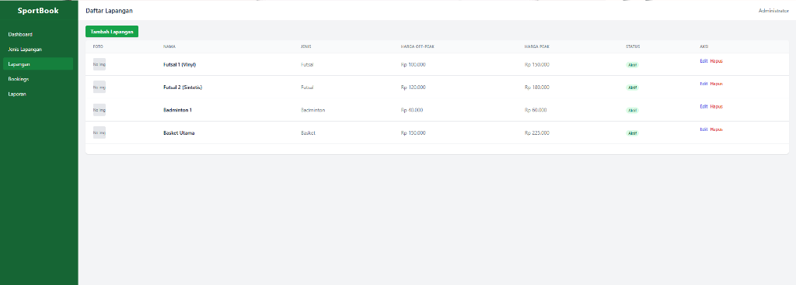

# Sistem Reservasi Lapangan Olahraga (SportBook)

**Proyek Ujian Akhir CPMK02 Pemrograman Web II - Paket 5**

**NIM:** H1D024085  
**Nama Mahasiswa:** Afkar Aufaa Farros  
**Paket:** Paket 5 (Sistem Reservasi Lapangan Olahraga)

---

## 📖 Deskripsi Proyek
SportBook adalah aplikasi berbasis web untuk melakukan pemesanan lapangan olahraga secara online. Sistem ini dirancang untuk mengatasi masalah *double-booking* dan memberikan kemudahan bagi pengguna dalam memilih waktu serta melihat ketersediaan lapangan secara *real-time*.

## ✨ Fitur Utama
1. **Autentikasi & Otorisasi:** Login dan registrasi terpisah antara Admin dan User (menggunakan Laravel Breeze).
2. **Manajemen Lapangan (Admin):** CRUD Jenis Lapangan (Futsal, Badminton, Basket) dan Lapangan.
3. **Katalog Lapangan (User):** Menampilkan daftar lapangan beserta filter dan detail harga.
4. **Booking & Deteksi Konflik (User):** Memilih jadwal kosong, sistem secara otomatis akan mencegah *double-booking* menggunakan deteksi konflik *real-time* di tingkat database (*unique constraint*).
5. **Harga Dinamis:** Kalkulasi harga otomatis untuk *Peak Hour* (17:00-22:00 = 1.5x lipat) dan *Weekend* (+20%).
6. **Validasi Multi-Slot Kontinu:** Memastikan pengguna memilih jam yang berurutan dalam satu kali sesi booking.
7. **Pembatalan & Kalkulasi Refund:** Pengguna dapat membatalkan pesanan. Dana akan dikalkulasi sesuai syarat (100% jika >= 24 jam, 50% jika 12-24 jam, 0% jika < 12 jam).
8. **Dashboard Admin:** Menampilkan kalender booking interaktif dan pendapatan hari ini.
9. **Laporan & Export (Admin):** Export rekapitulasi pendapatan ke format PDF.

## 🛠️ Tech Stack
- **Framework:** Laravel 13 (PHP 8.2+)
- **Database:** MySQL 8.0+
- **Frontend:** Laravel Blade, Tailwind CSS
- **Library Tambahan:** `barryvdh/laravel-dompdf` (Laporan PDF)

## 🚀 Cara Menjalankan Proyek (Instalasi)

1. Clone repository ini:
   ```bash
   git clone https://github.com/Charboros/pemweb2-paket5-H1D024085.git
   cd pemweb2-paket5-H1D024085
   ```
2. Install dependensi PHP & Node.js:
   ```bash
   composer install
   npm install
   npm run build
   ```
3. Salin file `.env.example` ke `.env` dan atur konfigurasi database MySQL:
   ```bash
   cp .env.example .env
   php artisan key:generate
   ```
4. Buat database di MySQL (misalnya `sportbook`), kemudian jalankan migrasi beserta seeder:
   ```bash
   php artisan migrate:fresh --seed
   ```
5. Tautkan storage agar foto lapangan dapat diakses:
   ```bash
   php artisan storage:link
   ```
6. Jalankan server lokal:
   ```bash
   php artisan serve
   ```
   Aplikasi dapat diakses di: `http://localhost:8000`

## 🔐 Kredensial Default (Seeder)

### Admin:
- **Email:** `admin@admin.com`
- **Password:** `12345678`

### User Biasa:
- **Email:** `user@user.com`
- **Password:** `12345678`

## 📸 Screenshot Aplikasi

### Halaman Home/Katalog Lapangan


### Halaman Riwayat Booking (User)


### Halaman Dashboard Admin (Kalender)


### Halaman Kelola Jenis Lapangan


### Halaman Kelola Lapangan


## 💡 Penjelasan Solusi Tantangan (Paket 5)

Proyek ini mengatasi beberapa tantangan teknis khusus untuk ujian CPMK02:

### 1. Mencegah Double-Booking (Race Condition)
Diimplementasikan menggunakan **Unique Constraint Database** langsung di MySQL. Ini menjamin pencegahan mutlak meskipun ada *race-condition* saat dua pengguna memesan di detik yang sama.
- **File:** `database/migrations/2026_04_25_001617_create_booking_slots_table.php` (`uk_slot`)
- **File:** `app/Http/Controllers/User/BookingController.php` (Menggunakan `DB::beginTransaction()` dan menangkap *error code* 23000).

### 2. Validasi Slot Jam Kontinu (Berurutan)
Sistem menolak booking jam yang terputus (misal: jam 08:00 dan jam 12:00 sekaligus).
- **File:** `app/Http/Controllers/User/BookingController.php` (Terdapat loop perhitungan matematis selisih antar slot di fungsi `store`).

### 3. Harga Dinamis (Peak Hour & Weekend)
Otomatis mendeteksi jika hari ini akhir pekan (+20% harga) dan jika jam yang dipesan masuk *Peak Hour* 17:00-22:00 (harga naik 1.5x).
- **File:** `app/Http/Controllers/User/BookingController.php` (Fungsi `store`).

### 4. Logika Refund Bertingkat
Menggunakan fitur manipulasi waktu `Carbon` untuk mengkalkulasi selisih jam dari waktu pembatalan hingga jadwal main (>= 24 jam kembali 100%, 12-24 jam kembali 50%, <12 jam kembali 0%).
- **File:** `app/Http/Controllers/User/BookingController.php` (Fungsi `cancel` menggunakan `now()->diffInHours($bookingDateTime)`).

## 📺 Tautan Video Demo YouTube
[LINK_VIDEO_YOUTUBE_ANDA]
